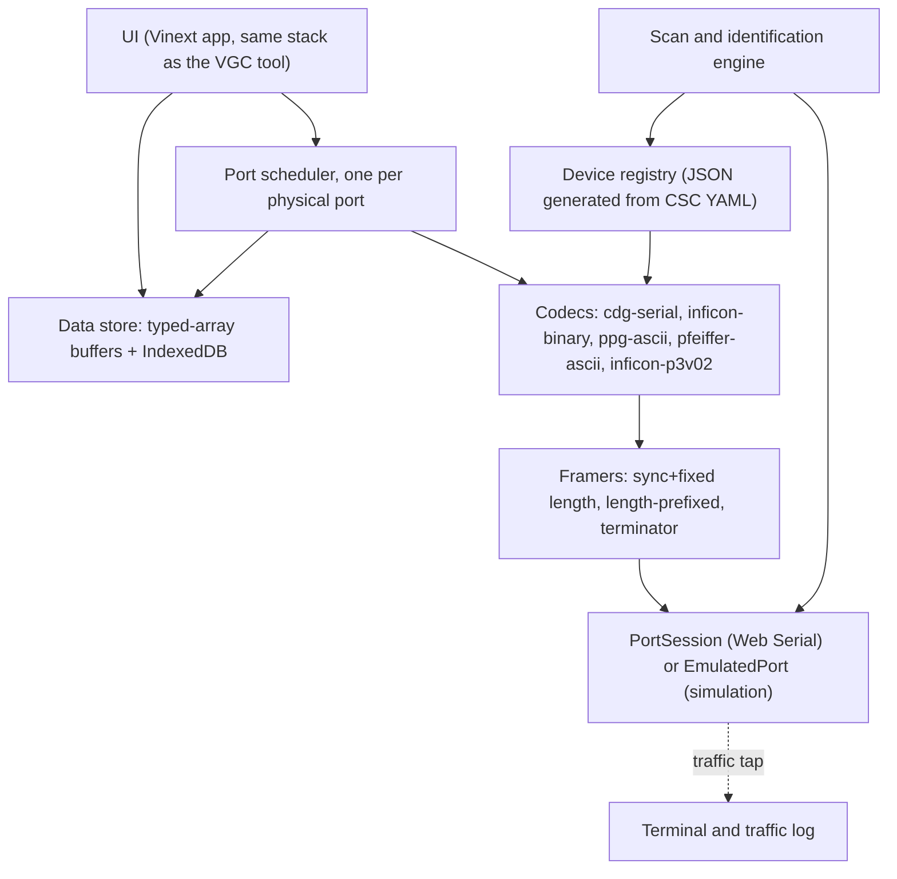

# Gauge Serial Communicator for the Browser: Port Plan

Draft 1, 2026-09-30. This plan covers porting the functionality and operator interface of [CustomSerialCommunicator](https://github.com/hipstereclipse/CustomSerialCommunicator) (CSC, the PyQt desktop app) into a static, browser-only application that talks to INFICON gauges through the Web Serial API and is built, tested and published on GitHub Pages the same way as [VGC-Serial-Communication-Tool](https://github.com/hipstereclipse/VGC-Serial-Communication-Tool) (the VGC tool).

## How to read this document

Every factual statement is traced to one of the sources in the table below, cited as S1, S2 and so on. Statements marked 🟠 are inferred, or come from a source other than the primary INFICON document for that device, and must be verified before the matching feature is promoted from experimental to stable. The orange circle stands in for the usual `#D97757` orange text, because GitHub strips inline color styling from rendered Markdown. Section 16 collects every 🟠 item into a single verification register.

| Ref | Source | Used for |
|---|---|---|
| S1 | CSC `README.md` | Feature inventory, architecture, runtime path, GUI workspaces, troubleshooting |
| S2 | CSC `docs/DRIVER_DEVELOPMENT.md` | Spec schema, codec contract, validation checklist, failure modes, staged rollout |
| S3 | CSC `src/serial_comm/protocols/cdg_serial.py` | CDG command and response frames, error bits, command table |
| S4 | CSC `src/serial_comm/protocols/pfeiffer_binary.py` | Current PSG/PCG binary codec |
| S5 | CSC `src/serial_comm/protocols/pfeiffer_ascii.py` | Pfeiffer ASCII codec |
| S6 | CSC `src/serial_comm/protocols/ppg_ascii.py` | PPG550/570 codec |
| S7 | CSC `GUI/gauge_workspace/port_scanner.py` | Scan order, probe frames, CDG model and full-scale inference |
| S8 | CSC `src/serial_comm/device_registry.py` | Protocol routing and spec loading |
| S9 | CSC `src/serial_comm/acquisition.py` | Poll loop, streaming loop, framing, error policy, terminal queue |
| S10 | VGC tool `README.md` | Web Serial workflow, trend, units, sessions, export, deployment, safety |
| S11 | VGC tool `docs/controller-adapters.md` | Adapter contract and the read-only probing rule |
| S12 | VGC tool `package.json` | Toolchain, pinned versions, npm scripts |
| S13 | CDG045D operating manual TINA51E1 rev h (2020-07) and the CDG communications-manual index, as transcribed in the `cdg-gauge` skill references | CDG045D RS232C line settings, protocol document names by interface |
| S14 | inficon.com PSG55x and PCG55x product pages, download sections | Existence of the shared "PxG55x Communication Protocol RS232C/RS485C" document |
| S15 | PCG55x brochure (copy hosted by idealvac.com) | PCG55x digital interface and RS485 connector variant |
| S16 | Agilent TQRA78E1, "RS232C Serial Interface for Pirani Diaphragm and Pirani Standard Gauges" (PCG-750/752, PVG-550/552) | 🟠 OEM protocol detail, used as a proxy until the INFICON PxG55x document is checked |

**What was not reviewed.** GitHub blocks automated fetching of repository directory listings, so the YAML files under `device_specs/` could not be located and read, and the per-model command tables in them are not reflected here. Separately, `session.py`, `export_dialog.py`, `transport.py`, `models.py`, `inficon_p3_v02.py`, the simulation modules, `turbos/`, the CSC tests, and every GUI file other than `port_scanner.py` were not reviewed for this draft. Anything in this plan that depends on those files is marked 🟠 and listed in section 16.

## 1. Goal and scope

The goal is a browser edition of CSC that keeps its operator workflow intact: add a gauge manually or by scan, let the tool map it to the right model configuration, poll one or more commands per device on a chosen interval, watch per-device and combined plots, inspect raw traffic, run simulations, save and restore sessions, and export readings (S1). It runs entirely in Chrome or Edge through Web Serial, with no Python, no installer and no data leaving the machine, and it is built and deployed the way the VGC tool is: a static build published to GitHub Pages from GitHub Actions, plus double-click launchers for running on `http://localhost` (S10, S12).

First-class device support, in priority order, is the SKY CDG045D over RS232C together with the rest of the SKY family the CSC codec already recognizes (CDG025D, CDG100D, CDG160D, CDG200D), then the PSG55x and PCG55x over both RS232C and RS485C, then the PPG550/PPG570, then the remaining families CSC already routes: Pfeiffer ASCII gauges such as the BCG450 and BCG552, the OPG550 over INFICON P3 V02, and the TC600 turbo workspace (S1, S3, S5, S6, S8).

Out of scope for this port are the fieldbus variants (EtherCAT, Profibus, DeviceNet, Profinet), analog readout, Firefox and Safari (neither implements Web Serial, S10), and the VGC50x, VGC031, VGC083 and VGC094 controllers, which the VGC tool already serves. A gauge ordered with only a fieldbus interface is simply not reachable from this tool, and the Add Gauge dialog should say so rather than failing silently.

A working repository name that mirrors the VGC tool is `Gauge-Serial-Communication-Tool`, which would publish at `https://hipstereclipse.github.io/Gauge-Serial-Communication-Tool/`, following the VGC tool's Pages URL pattern (S10).

## 2. Feature parity matrix

This is the checklist that defines "keeps the core functionality." A phase number refers to the roadmap in section 15.

| # | CSC capability (S1 unless noted) | Where it lives in CSC | Browser equivalent | Phase |
|---|---|---|---|---|
| 1 | Connect over RS-232 and RS-485 | `transport.py`, `acquisition.py` | `PortSession` over Web Serial; RS-485 through a USB adapter, one session per physical port shared by every address on the bus | 0 to 2 |
| 2 | Auto-scan COM ports and identify responsive instruments | `port_scanner.py` | Scan of *granted* ports; the user grants each adapter once in the browser picker, because a page cannot enumerate ports it was not given | 1 |
| 3 | Multi-select scan results and add them in one action | `add_gauge_dialog.py` | Same, in the Add Gauge dialog | 1 |
| 4 | Automatic model mapping, with CDG full-scale hints when confidence is sufficient | `port_scanner.py` metadata | Same, plus a mandatory full-scale confirmation step for CDGs | 1 |
| 5 | Poll one or more commands per device on a configurable interval | `GaugeWorker._run_polled` (S9) | Port scheduler poll jobs | 1 |
| 6 | Continuous-output devices (CDG) | `GaugeWorker._run_continuous` (S9) | Streaming mode on the port session with a sync-and-length framer | 1 |
| 7 | Per-gauge tabs with values and terminal output | `gauge_tab.py`, `terminal_widget.py` | Device tab: value card, status chips, trend, poll controls, terminal | 1 |
| 8 | Protocol-aware terminal traffic | `_execute_terminal_command` (S9) | Terminal with ASCII/HEX views and a frame builder that computes checksums and CRCs | 1 |
| 9 | Registry-driven drivers (YAML specs plus codecs), experimental models marked | `device_registry.py`, `device_specs/` | JSON specs generated at build time from the same YAML; codecs as plain ES modules | 0 |
| 10 | Structured errors that never crash the acquisition loop | `DeviceError`, defensive parsers | Same event model | 0 |
| 11 | Loopback and echo detection | `_LOOPBACK_CYCLES`, scanner echo checks (S7, S9) | Same rules, same constants | 1 |
| 12 | Combined multi-gauge plots: overlay, stacked, grid; visibility toggles; per-device colors; synchronized navigation; full session history per series | `combined_tab.py` | Combined view on a shared canvas trend engine | 3 |
| 13 | Save and restore sessions, real and simulated devices | `session.py` | IndexedDB autosave plus JSON import and export | 3 |
| 14 | Export captured readings | `export_dialog.py` | Measurement CSV, traffic CSV, transcript, session JSON (minimal CSV already in phase 1) | 1, 3 |
| 15 | Simulation with leak, humidity, gas type, base pressure and recipes; OPG optical spectra | `simulation_*.py`, `opg_spectrum.py` | JS simulation engine plus protocol emulators behind a fake port | 4 |
| 16 | TC600 turbo workspace | `GUI/turbo_workspace`, `src/serial_comm/turbos` | Turbo workspace | 5 |
| 17 | OPG550 Spectrum Studio: fixed-position hover bar, Δ(A-B) and Δ% between sources, full peer-pressure history, plasma ignition thresholds shown in the active unit but stored and evaluated in mbar | README, Spectrum Studio section | Spectrum Studio | 6 |

The VGC tool adds several things CSC does not have, and the plan adopts them because they already work in the browser and David's users will meet both tools: a display-only units control, a searchable command dictionary with safe/caution/danger risk labels, a guided command builder with a live byte preview, multi-format input (ASCII, escaped text, hex, decimal, Base64), IndexedDB autosave, light and dark themes, a no-hardware demo, and the double-click launchers (S10).

## 3. What Web Serial changes

The Python app can open any COM port, block on `read_until`, and give every gauge its own thread (S9). None of that carries over directly. The table lists each platform constraint, what it breaks, and the design response. Rows marked 🟠 describe Web Serial behavior taken from general knowledge of the API rather than from the VGC README, and are verification item V15.

| Constraint | Consequence | Design response |
|---|---|---|
| Only Chromium desktop browsers (Chrome, Edge) implement Web Serial (S10) | Some field laptops cannot run the tool | Check for `navigator.serial` at load; show a plain unsupported-browser page that points to the desktop CSC |
| A secure context is required: `https://` or `http://localhost` (S10) | Nothing, on GitHub Pages; local use needs a localhost server | Reuse the VGC launchers unchanged in behavior (S10) |
| A page can only open ports the user granted through the browser picker, and the picker needs a click (S10) | CSC's "probe every COM port" scan cannot be reproduced silently | A "Grant ports" step; the scan iterates previously granted ports; reuse the VGC tool's saved-port management UI |
| Windows COM names are not exposed; a saved port is identified by USB vendor and product ID when the browser provides them (S10) | 🟠 Two identical USB adapters cannot be told apart after a reload | Let the user name each granted port; on session restore, re-identify each port by probe and match model plus serial number |
| CSC skips virtual TCP/IP COM adapters by reading the port description, because opening them can block the scan (S7) | 🟠 The description string is not available to the page | Per-open timeout, plus an "exclude this port from scans" option stored per granted port |
| Line settings are fixed at open; changing baud means closing and reopening, which the VGC tool already does for Auto baud (S10) | Multi-baud scans and baud-rate writes | A `reopen(settings)` helper that drains, closes, and reopens the same granted port |
| Data arrives in arbitrary-size chunks from a readable stream; there is no `read_until`, `read_bytes` or read timeout as used in S9 | All framing and timeouts must be explicit | A framer per protocol (section 4) and timeouts built on `AbortSignal` and `Promise.race` |
| 🟠 The default read buffer is 255 bytes | A CDG stream at 9600 baud 8N1 can deliver up to about 106 frames per second (9600 / 10 bits per byte / 9 bytes per frame) | Open streaming ports with a larger `bufferSize` (4096 is ample) and keep a read loop running at all times |
| JavaScript runs on one thread, where CSC gives each gauge a `QThread` (S9) | A long render could delay reads | Reader loops never await UI work; charts draw on `requestAnimationFrame` from buffered data; 🟠 evaluate moving the scheduler into a dedicated worker once Web Serial availability in workers is confirmed for the target browser versions |
| 🟠 Timers in hidden tabs are throttled | Poll timers in a background tab can slow down during long unattended logs | Detect visibility changes, show a banner, and record gaps explicitly; run a soak test (section 13) before trusting overnight logs |
| 🟠 Windows serial ports are opened exclusively | Opening fails if the desktop CSC or a terminal program holds the port | Report "port busy" in plain words instead of a stack trace |
| 🟠 The page can drive RTS and DTR through `setSignals`, but not with byte-level timing | Manual RS-485 direction switching from JavaScript is unreliable | Require auto-direction USB-RS485 adapters; keep CSC's echo suppression (S9) for adapters that echo transmitted bytes |

## 4. Architecture

The port keeps CSC's central idea, that model-specific behavior lives in specs and codecs while the UI only visualizes and orchestrates (S1), and adds two layers the browser forces on it: an explicit framer between the byte stream and the codec, and a scheduler that owns each physical port.



**Framework-free core.** All device logic (transport wrapper, framers, checksums, codecs, registry, scan plans, scheduler, unit conversion, simulation) lives in plain ES modules with JSDoc types and `// @ts-check`, the same way the VGC tool keeps controller logic in `public/controllers.js` and tests it with plain Node scripts (S10, S12). That means no compile step for the core and every codec test runs in Node without a browser.

**One port session per physical port.** A `DeviceSession` is a pair of (port, address). On RS232 there is one device per port; on an RS485 bus there can be many, and they must share one open port and one transaction queue. 🟠 CSC appears to give every `GaugeWorker` its own `SerialTransport` (S9), which cannot serve two gauges on the same RS485 bus; this is an inference from `acquisition.py` alone and is verification item V16.

**Framing moves into the codec.** CSC decides how to read a response with `isinstance` checks inside `acquisition.py`, and the driver guide notes that a new protocol may need edits there (S2 section 4.3, S9). In the port each codec returns its own framer, so adding a protocol never touches the scheduler.

**Specs stay YAML at the source.** During the port, the YAML in CSC's `device_specs/` remains the single source of truth. A build script (`scripts/specs-build.mjs`) converts it to JSON, validates it against a schema, and fails CI on unknown fields. The web build adds a few fields CSC does not have yet: a `risk` class per command (safe, caution, danger, as in S10), a `probe` plan, a `defaultUnit` (the VGC tool requires one for every identified device, S11), and a `source` string on every command and line default (for example `"TIRA49E1"`), so each number in the UI can be traced to a document.

The codec contract is a direct translation of CSC's `GaugeProtocol` (S2, S3):

```js
// @ts-check
/**
 * @typedef {Object} Reading            // mirrors CSC GaugeReading
 * @property {boolean} success
 * @property {number=} value
 * @property {string=} unit
 * @property {string=} formatted
 * @property {Uint8Array} raw
 * @property {Object=} extra            // warnings, status bytes, sensor code, etc.
 * @property {string=} error
 *
 * @typedef {Object} Framer
 * @property {(chunk: Uint8Array) => Uint8Array[]} push   // returns complete frames
 * @property {() => void} reset
 *
 * @typedef {Object} Codec
 * @property {number} address
 * @property {() => Framer} framer
 * @property {(command: string, value?: any) => Uint8Array} buildRequest
 * @property {(frame: Uint8Array, command: string) => Reading} parseResponse
 * @property {() => boolean} supportsContinuousOutput
 * @property {(frame: Uint8Array) => Reading=} parseContinuous
 * @property {(frame: Uint8Array, command: string) => boolean=} matchesResponse  // needed on streaming lines
 */
```

Three framers cover every protocol CSC handles today. A **sync-and-fixed-length** framer (CDG: sync `0x07`, 9 bytes, checksum-validated, sliding one byte to resynchronize on failure, as `_first_cdg_frame` does in S7). A **length-prefixed** framer (PxG55x binary: total length is header byte 3 plus 6; P3 V02: total length is the 16-bit value in header bytes 3 and 4 plus 7, both as read in S9). A **terminator** framer (PPG: backslash; Pfeiffer ASCII: CR, S5, S6).

## 5. Device families and protocol plans

### 5.1 Summary

| CSC protocol key | Models | Framing | Integrity check | Line defaults and source | Web framer |
|---|---|---|---|---|---|
| `cdg_serial` | CDG025D, CDG045D, CDG100D, CDG160D, CDG200D; HPG400 appears in the sensor-code map (S3) | 5-byte command, 9-byte response, sync `0x07`, streams after a read request | 8-bit sum | 9600 baud, binary, 8 data bits, 1 stop bit, no parity, no handshake, for the CDG045D (S13) | Sync + fixed length |
| `inficon_binary` / `pfeiffer_binary` | PSG55x, PCG55x | 4-byte header + APDU + 2-byte CRC | CRC-16 (see 5.3) | 🟠 factory 57600, selectable 9600 to 57600, per the OEM document (S16) | Length-prefixed |
| `ppg_ascii` | PPG550, PPG570 | ASCII, backslash terminator | none | 🟠 9600, the rate CSC scans at (S7); confirm in the PPG manuals | Terminator `\` |
| `pfeiffer_ascii` / `inficon_ascii` | BCG450, BCG552, OPG550 gauge side, TC600 (S5 docstring) | ASCII, CR terminator | 3-digit decimal checksum | 9600, the rate CSC scans at (S7) | Terminator CR |
| `inficon_p3_v02` | OPG550 | 5-byte header + APDU + 2-byte CRC | 🟠 CRC details not reviewed | 115200, as CSC probes it (S7) | Length-prefixed |

### 5.2 CDG045D and the SKY CDG family (RS232C)

**Line settings and documents.** The CDG045D RS232C interface runs at 9600 baud, binary, with 8 data bits, one stop bit, no parity and no handshake (S13, TINA51E1 rev h). Those figures are transcribed from the CDG045D manual only. Each SKY model has its own operating manual (TINA49E1 for the CDG025D, TINA52E1 for the CDG080D/100D, TINA53E1 for the CDG160D/200D), and the spec file for each model must take its line defaults from its own manual rather than inheriting the CDG045D values (S13, verification item V10). The RS232C protocol itself is documented in TIRA49E1, which is shared across models (S13), and it is the document the CSC codec cites (S3). 🟠 The CSC repository root contains a file named `cdg_proto.pdf` that is probably this document, judging by the filename alone (V19).

**Interfaces.** The CDG communications-manual index lists RS232C, a separate RS232 ASCII protocol, Profibus, DeviceNet, EtherCAT, Profinet, 4-20 mA, and CDGsci-specific protocols, and it has no RS485 entry (S13). The plan therefore treats the CDG family as RS232C only. The RS232 ASCII protocol is not implemented in CSC, and 🟠 the index does not record which models speak it, so no Edge or Stripe model is claimed until that is checked (V9).

**Frames** (as implemented in S3, which cites TIRA49E1):

| Direction | Byte 0 | Byte 1 | Byte 2 | Byte 3 | Byte 4 | Byte 5 | Byte 6 | Byte 7 | Byte 8 |
|---|---|---|---|---|---|---|---|---|---|
| Host to gauge (5 bytes) | `0x03` | Service: `0x00` read, `0x10` write, `0x40` special | Register | Data | Sum of bytes 1 to 3, mod 256 | | | | |
| Gauge to host (9 bytes) | `0x07` | Page | Status | Error | Measurement high | Measurement low | Read-command echo | Sensor type code | Sum of bytes 1 to 7, mod 256 |

**Pressure.** The measurement word is a signed 16-bit integer; the ratio is that value divided by 16384, clamped to the range -0.024 to +1.024, and multiplied by the full scale (S3). The reading is therefore only as good as the configured full scale, and CSC's own guide warns that treating 10 Torr and 10 mbar as equivalent produces errors of about 1.333x or 0.75x (S2 section 8.4). The web Add Gauge dialog shows full-scale options with explicit units, Torr-native and mbar-native side by side (the option list is in S7 and Appendix C), prefills a value only when scan inference found one within its 5 % tolerance (S7), and will not start logging until the user confirms it. The confirmed full scale, and whether it came from the user or the scan, is written into the session and into every export header.

**Error byte** (S3). Bits `0x20` (bad measurement) and `0x40` (sensor fault) are fatal and the reading is discarded. Bits `0x01` underrange, `0x02` overrange, `0x04` zero adjust running, `0x08` full-scale adjust running, `0x10` extended status and `0x80` sensor not ready are warnings. CSC also promotes a saturated ratio to an over- or underrange warning when the error byte does not flag it (S3). The port keeps all of this exactly, shows warnings as status chips on the value card, and, following the VGC trend rule, marks over- and underrange samples on the trace but leaves them out of the statistics (S10).

**Streaming.** A read request starts continuous output, and CSC then reads frames with a sync-and-length reader (S3, S9). In the browser the framer runs continuously. When the terminal or the scanner sends another command on a streaming line, the scheduler writes it and takes the first valid frame whose byte 6 (read-command echo) matches the requested register, as the scanner does with the type query (`read_echo=0x3B`, S7). Pausing polling flushes input so stale frames do not collide with ad-hoc commands (S9).

**Identification** (S7). Send `03 00 00 00 00`, look for a valid frame, then send the type query `03 00 3B 00 3B`. The model comes from the sensor code (`0x00` CDG025D, `0x01` CDG045D, `0x02` CDG100D, `0x03` CDG160D, `0x04` CDG200D, `0x0B` HPG400), preferring the type-query reply when it carries a model byte and guarding against reading a plain integer full-scale reply as a model code (S7). Full scale comes from the type word: first a direct Torr-native map (1, 2, 10, 20, 100, 200, 500, 1000), then scaled candidates matched to the option list within 5 % relative error, otherwise no hint (S7). CSC keeps two copies of the sensor-code map (`_GAUGE_TYPE_MAP` in S3 and `_CDG_SENSOR_MODELS` in S7); the port keeps one, in the spec.

**Commands and risk classes** (frames from S3; risk classes are this plan's proposal):

| Command | Service, register | Risk | Notes |
|---|---|---|---|
| `pressure` | `0x00`, `0x00` | safe | Starts continuous output |
| `cdg_type` | `0x00`, `0x3B` | safe | Full-scale / type code |
| `firmware` | `0x00`, `0x10` | safe | |
| `serial_number` | `0x00`, `0x11` | safe | |
| `setpoint_1_read`, `setpoint_2_read` | `0x00`, `0x20` / `0x22` | safe | |
| `unit` | `0x10`, `0x04` | caution | 0 mbar, 1 Torr, 2 Pa per S3 |
| `data_tx_mode` | `0x10`, `0x01` | caution | 🟠 Semantics and resulting stream rate not reviewed (V8) |
| `setpoint_1_low` to `setpoint_2_high` | `0x10`, `0x20` to `0x23` | danger | Switches relays; 🟠 the codec sends a single data byte, encoding to be checked in TIRA49E1 (V7) |
| `reset` | `0x40`, `0x00` | danger | |
| `factory_reset` | `0x40`, `0x01` | danger | |
| `zero_adjust` | `0x40`, `0x02` | danger | For the CDG045D, zeroing is locked at atmosphere and during warm-up (S13); the confirm dialog shows the preconditions from the connected model's own manual |
| `fs_adjust` | `0x40`, `0x03` | danger | |
| `clear_zero` | `0x40`, `0x04` | danger | |

🟠 CSC does not decode the status byte (setpoint, unit and zero bits), and the port should only do so once the bit meanings are read from TIRA49E1 (V6).

### 5.3 PSG55x and PCG55x (RS232C and RS485C)

**What is established.** INFICON publishes a single "PxG55x Communication Protocol RS232C/RS485C" document on both the PSG55x and PCG55x product pages (S14). The PCG55x brochure lists RS232C as the digital interface, a 15-pin HD D-Sub connector variant "with RS485", and a 30 m cable limit for RS232C operation (S15). CSC routes both families through its `pfeiffer_binary` codec with a device ID and pressure encoding taken from the YAML (S8), and the codec's docstring assigns the `Fixs32en20` encoding to PCG and PSG (S4).

**What the OEM document says** (🟠 all of this is from S16, the Agilent-branded PCG-750/752 and PVG-550/552 document, and is verification item V1 until checked against the INFICON PxG55x document):

| Aspect | S16 content |
|---|---|
| Master-slave | The gauge transmits nothing without a request |
| Line format | Binary, 8 data bits, 1 stop bit, no parity, no handshake |
| Baud | Parameter PID 227: 9600, 19200, 38400, 57600; factory setting 57600 |
| RS232 address | Always 0 |
| Frame | Address, Device ID, Ack, MsgLength, Cmd, PID (2 bytes, MSB first), Reserved (2 bytes), Data (n bytes), CRC (2 bytes); maximum 64 bytes per frame |
| MsgLength | Counts Cmd, PID, Reserved and Data |
| Cmd | 1 read request, 2 read response, 3 write request, 4 write response |
| Device ID | Master 0, PCG-7xx 2 |
| Data byte order | Big endian |
| Errors | PID set to `0xFFFF` plus an error byte: 1 access error, 2 value above max or below min, 3 parameter not found, 4 length error, 6 memory access error, 7 memory access timeout |
| CRC | CRC-16, polynomial `0x8408` (reflected form), initial value `0xFFFF`, transmitted little endian |
| Fixs32enXX | Divide the integer by 2^XX (the document's example: 10 mbar is sent as 10485760) |
| Caution | Operating the gauge through the serial interface and a fieldbus or the diagnostic port at the same time is not permitted |

Key parameters from S16 (🟠): PID 221 pressure (`Fixs32en20`), PID 222 pressure (`Real32`), PID 224 data unit (0 mbar, 1 Torr, 2 Pa, 3 micron, 4 counts; "changes the pressure unit of all Real32 pressures"), PID 228 device exception (including Pirani filament rupture and CDG diaphragm rupture), PID 223 active instance (1 CDG, 2 Pirani, 3 mixed), PID 207 serial number, PID 208 product name, PID 209 manufacturer, PID 218 software version, PID 104 run hours (`Fixs32en2`), PID 103 reset and factory reset, PID 417 Pirani adjust, PID 414 CDG zero adjust, PID 421 CDG auto zero, PID 265 ATM pressure, PID 448 ATM adjust, and the setpoint block PIDs 275 to 288 and 455 to 462. S16 marks the CDG and ATM parameters as not available on the Pirani-only model, so the PSG spec omits them and the PCG spec includes them.

**Findings against the current CSC codec.** These came out of reading S4, S7 and S8 against S16, and the first two were checked by computation while preparing this plan.

| # | Current CSC behavior | S16 | Evidence | Action in the port |
|---|---|---|---|---|
| 1 | CRC is computed MSB-first with polynomial `0x1021`, initial `0xFFFF` (`_crc16` in S4) | Reflected polynomial `0x8408`, initial `0xFFFF`, no final XOR, low byte first | All four example frames in S16 validate with the reflected algorithm, and none validate with the current routine (vectors in Appendix A) | Implement the reflected CRC; the four frames become permanent unit tests |
| 2 | `Fixs32en20` is decoded as 10^(raw / 2^20) (S4) | Linear: raw / 2^20 | S16's example read response carries `0x375A05BF`, which is 885.63 mbar linearly; the current expression evaluates 10^885.6 and raises `OverflowError` in Python | Decode linearly; keep `LogFixs32en26` as a separate, unverified encoding (V11) |
| 3 | The registry never passes `rs485_mode`, so request byte 0 is always `0x00` (S4, S8) | RS232 address is 0; RS485 needs the device address | Code reading | Send the configured address whenever the port is in RS485 mode |
| 4 | Request byte 1 carries the gauge's device ID (default `0x02`, S4) | Example requests carry `0x00` (master); responses carry `0x02` | 🟠 Whether a gauge rejects `0x02` in a request is unknown (V4) | Send `0x00` in requests; validate the spec's device ID in responses |
| 5 | Response Cmd and Ack are not checked, and a `0xFFFF` error frame would be decoded as data (S4) | Cmd 2 or 4, Ack `0x01` in the examples; error byte codes defined | Code reading | Validate Cmd and Ack; decode error frames into a readable `DeviceError` |
| 6 | The scanner never probes this protocol, and it probes only at 9600 baud (S7) | 🟠 Factory baud 57600 (V2) | Code reading | Add a PxG probe at 57600, 38400, 19200 and 9600 (section 6) |

Taken together, 🟠 it is likely that the PSG/PCG path in CSC has never exchanged a valid frame with a real gauge. That is an inference from the code, and one bench session with a PSG55x will confirm or refute it quickly. The web port should implement this protocol from the INFICON PxG55x document, using S16 as a cross-check and not the Python as the reference, and the fixes should be back-ported to CSC so the two codebases stay equivalent.

**Pressure source.** 🟠 Because S16 says PID 224 changes the unit of the *Real32* pressures, PID 221 (`Fixs32en20`) is presumably always mbar (V3). The port logs PID 221, reads PID 224 once after identification to label the display (the VGC tool's `unitRead` pattern, S11), and offers PID 222 as an alternate poll command. On a PCG the value card also shows the active instance (PID 223: CDG, Pirani or mixed) and the ATM pressure (PID 265) as a secondary reading.

**RS485.** Each device on the bus gets its own address; the bus scan sweeps an address range; the scheduler keeps one transaction outstanding per port. 🟠 The RS485 factory address, the valid address range, the RS485 baud options and any turnaround delay are in the INFICON PxG55x document, not in S16, which covers RS232C only (V2).

**Risk classes** (proposal): all reads safe; PID 224 unit caution; PID 421 auto zero caution; PID 227 baud danger, because a successful write drops the link until the port is reopened at the new rate (section 11); PID 103 reset, PIDs 417, 414 and 448 adjustments, and every setpoint write danger.

### 5.4 PPG550 and PPG570

Ported one-to-one from S6 and S7. Requests are `@{address:03d}{mnemonic}{?|!}{value}\` with a backslash terminator and no checksum; responses are `@ACK...\` or `@NAK...\`, and some firmware inserts the address (`@253ACK...\`), which the codec normalizes. Address 254 is the broadcast address used in RS232 mode. Pressure responses can be status words instead of numbers (UR, OR, NO SENSOR, WAIT, HV OFF, LO SN, ATM, ERR, PROG and variants), which become status chips rather than parse errors. The runtime fallbacks are kept: `PR3` and `P` swap on an UNKNOWN COMMAND reply, and `P?CMB` downgrades to `P?`. `PR1` is PPG570-only, and the two models are offered as one combined selection to avoid false splits (S1, S7). The `query_param` and `write_prefix` spec fields carry indexed commands such as per-setpoint writes (S2). Proposed risk classes: `U` caution; `VAC`, `FS`, `ATZ` and `ATD` danger; reads safe. On an RS485 bus, real addresses replace the broadcast address.

### 5.5 Pfeiffer ASCII family (BCG450, BCG552, OPG550 gauge side, TC600)

Ported one-to-one from S5. The frame is a 3-digit address, 2-character action (`00` read, `10` write or response), 3-digit parameter number, 2-digit data length, data, a 3-digit checksum (sum of all preceding characters mod 256) and CR. Reads send `=?`. `NO_DEF`, `_RANGE` and `_LOGIC` in the data field are device errors. All data types in S5 are kept (`boolean_old`, `boolean_new`, `u_integer`, `u_short_int`, `u_real`, `u_expo`, `u_expo_new`, string). The scanner reads parameter 309 (firmware) and falls back to 310, rejects frames whose action is not `10` or `11` so an echoed request never validates, and maps the firmware string to a model hint (S7).

### 5.6 INFICON P3 V02 (OPG550)

The scanner reopens at 115200 baud and reads PIDs 10001 (product name), 10000 (manufacturer), 10002 (serial number) and 10004 (software version); frames are a 5-byte header with a 16-bit APDU length, the APDU, and a 2-byte CRC (S7, S9). 🟠 The CRC and APDU details live in `inficon_p3_v02.py`, which was not reviewed (V13).

### 5.7 Other families

HPG400 appears in the CDG sensor-code map as `0x0B` (S3, S7), so it shares the 9-byte frame, but 🟠 its pressure conversion is not covered by the CDG ratio formula and must come from the HPG400 manual (V12). 🟠 The S4 docstring assigns the binary protocol with `LogFixs32en26` to MAG, MPG, BPG and BCG; given that the `Fixs32en20` decode turned out to be wrong, that claim needs its own verification (V11). All of these ship as experimental, following CSC's staged rollout (S2 section 9).

## 6. Scan and identification workflow

The scan keeps CSC's behavior, including its rule that probes are active and structured rather than guesses from a display string (S1, S7), and the VGC tool's rule that automatic probing sends read-only commands only and that an identity needs the active probe plus a model-specific signature (S11). What changes is how ports are found, and the addition of the PxG55x probe that CSC lacks.

**Step 1, grant.** An "Add ports" button calls the browser picker, once per adapter. Granted ports are listed with their USB vendor and product IDs where available and a user-editable name (S10).

**Step 2, scope.** The user picks which granted ports to scan, RS232 or RS485 per port (RS485 enables the address sweep), and Quick (documented factory rates only) or Thorough (every rate).

**Step 3, per-port probe plan.** Every probe below is a read. The plan stops at the first verified identity. Each probe waits up to 0.6 s, CSC's `_PROBE_TIMEOUT` (S7).

| Order | Line settings | Probe | Identity rule | Source |
|---|---|---|---|---|
| 1 | 9600 8N1 | Listen passively for about 300 ms before sending anything | Valid 9-byte CDG frames already on the line mean a CDG left streaming from an earlier session | New; S7 notes CDG output needs no probe |
| 2 | 9600 8N1 | `@254FV?\`, then `@254SN?\`, `@254PR1?\`, `@254PR3?\` | ACK (plain or address-prefixed); reported as PPG550/570 | S7 |
| 3 | 9600 8N1 | Pfeiffer ASCII read of parameter 309, fallback 310 (`0010030902=?107` + CR, `0010031002=?099` + CR) | Valid response frame with action `10` or `11` and correct checksum; model hint from firmware string; TC600 routes to the turbo workspace | S7 |
| 4 | 9600 8N1 | CDG read `03 00 00 00 00`, then type query `03 00 3B 00 3B` | Valid frame; model and full-scale hint as in 5.2 | S7 |
| 5 | 9600 8N1 | PxG55x read of PID 208 (product name) | 🟠 Response Cmd 2 with a product-name string containing PSG or PCG (V5), confirmed by a PID 221 read | New |
| 6 | 57600, 38400, 19200 8N1 | PxG55x read of PID 208 | Same as 5; 57600 first because S16 gives it as the factory rate 🟠 | New |
| 7 | 115200 8N1 | P3 V02 reads of PIDs 10001, 10000, 10002, 10004 | CRC-valid ACK with a product name | S7 |

Echo handling follows CSC: if the bytes received equal the probe just sent, read once more, and if nothing else arrives report "echo but no response, likely loopback or no gauge" and stop probing that port (S7). A silent port costs roughly 5 s in Thorough mode (0.3 s listen plus four 0.6 s probes at 9600, three at the higher rates and one at 115200), plus reopen time.

**Step 4, RS485 address sweep.** Only on ports marked RS485, and only when asked, because it is slow: one read per candidate address with a short timeout, using the address range from each family's own manual (🟠 V2 for PxG55x). Broadcast addresses are never used on a multi-drop bus.

**Step 5, results.** One row per found device, carrying structured metadata (family, model hint, firmware, serial number, a pressure snapshot, CDG full-scale hint and whether it cleared the confidence bar, experimental flag), as CSC's `port_found` signal does (S7). Rows are multi-selectable, and selecting one aligns the model and port automatically (S1).

**Step 6, confirm and add.** Mandatory full-scale confirmation for CDGs, address confirmation for RS485 devices, poll command selection and interval, then Add. On a later session restore, each granted port is re-identified by probe and matched on model plus serial number before logging resumes, because the port itself cannot be pinned reliably (section 3).

## 7. Acquisition and scheduling

Each `PortSession` wraps one granted Web Serial port and exposes `open(settings)`, `close()`, `reopen(settings)`, `write(bytes)`, an async stream of frames cut by the active codec's framer, and a traffic tap that records every chunk in both directions with a timestamp and the exact bytes (the VGC tool stores exact bytes for every event, S10).

One `PortScheduler` per port runs a single queue with four job types: poll (device, command), terminal (raw bytes or a built command), confirmed write, and streaming control. The rules are the CSC rules, restated for a shared port.

Only one transaction is outstanding on a port at any time, which is what a half-duplex RS485 bus requires. A poll cycle walks the devices on the port in order, honors each device's own interval, and never starts a new cycle before the previous one finishes. The UI shows the achievable rate, since the wire alone limits it: a PxG55x read is 26 bytes round trip (11 out, 15 back), which is about 27 ms of line time at 9600 baud and about 4.5 ms at 57600 at 10 bits per byte, before the gauge's own response time 🟠, which has to be measured.

Terminal jobs are drained between poll transactions, as CSC drains its terminal queue at the top of every cycle (S9). If the first frame after a write equals the request byte for byte, it is treated as an RS485 echo and the scheduler waits for the next frame (S9).

The error policy uses CSC's constants unchanged: a 2.0 s pause after a recoverable transport error, 5 consecutive errors before the link is declared dead, and 5 consecutive silent cycles before the "TX is echoing without response, check cable pinout, power, and loopback plug" message (S9). In streaming mode, 5 consecutive empty reads produce "No data from CDG" (S9). Every failure is a structured `DeviceError` with a recoverable flag, never an unhandled exception (S1, S2).

Each sample carries a monotonic timestamp (`performance.timeOrigin + performance.now()`) and a wall-clock timestamp, matching CSC's `timestamp_mono` and `timestamp_wall` (S9). 🟠 USB unplug and replug are handled through the Web Serial `disconnect` and `connect` events: the device goes offline, and when the port returns it is re-identified before polling resumes (V15).

## 8. User interface

The layout follows CSC's main workspace (device list panel, add gauge, simulate and turbo actions, per-gauge tabs, combined plot tab, S1) with the VGC tool's header controls on top.

```
┌ Header: app name · Units [Auto ▾] · Theme · Session name · Autosave ● · Export ┐
├───────────────┬────────────────────────────────────────────────────────────────┤
│ Devices       │ Tabs: [CDG045D @ Port A] [PCG550 #2 @ Port B] [Combined] [Sim] │
│  Port A RS232 │  ┌ Value card: 1.234E-02 Torr · status chips · FS 10 Torr ───┐ │
│   CDG045D  ●  │  │ Trend: log/linear · window · freeze · stats · export view │ │
│  Port B RS485 │  ├ Poll: [x] pressure [ ] atm_pressure · every 100 ms ───────┤ │
│   PCG550 #2 ● │  └ Terminal: ASCII / HEX · frame builder · traffic log ──────┘ │
│   PSG550 #3 ● │                                                                │
│ [+ Add gauge] │                                                                │
│ [Simulate]    │                                                                │
│ [Turbo]       │                                                                │
└───────────────┴────────────────────────────────────────────────────────────────┘
```

**Add Gauge dialog.** Everything CSC's dialog does (S1): model selection with experimental models visibly marked, port selection with refresh, background scan with per-port status text (CSC emits messages such as "trying INFICON PPG ASCII commands", S7), multi-select results, advanced transport settings (baud, RS mode, address), and command selection with interval tuning. The browser adds the grant step and the CDG full-scale confirmation.

**Device tab.** A value card in the display unit, which also names the value as reported when a conversion is applied (the VGC tool's "reported as" pattern, S10); status chips for CDG warnings, PPG status words and PxG55x device exceptions; the per-device trend; poll controls; and the terminal.

**Combined tab.** Overlay, stacked and grid layouts, visibility toggles, per-device colors, synchronized navigation, and full session history per series so gauges at different poll rates still share a comparable time axis (S1). The shared hover bar keeps the cursor X value fixed at the far left, the convention CSC uses in Spectrum Studio (S1).

**Trend engine.** The VGC tool's trend already does most of what is needed: log decade gridlines or linear ticks, 1 min to whole-session windows, freeze, hover crosshair, per-channel last, min, max, mean and a least-squares rate in decades per minute, per-pixel-column decimation that keeps extremes, and broken lines on non-OK status and on silences far longer than the channel's cadence (S10). The plan generalizes it from channels of one controller to series from many devices and adds the three combined layouts, rather than introducing a charting library. 🟠 If canvas performance falls short with many long series, uPlot is the fallback to evaluate, bundled locally rather than loaded from a CDN so the tool keeps working offline.

**Terminal.** ASCII, ASCII + HEX and HEX views, follow and clear (S10), and the VGC input formats and line endings (S10). Binary protocols need more than raw hex entry, so the composer gains a frame builder: pick a command or PID and a value, and it assembles the frame with the correct checksum or CRC and shows the bytes before sending. Raw hex is still allowed, but a frame whose checksum or CRC does not validate is flagged before it goes out.

**Command dictionary.** Generated per device from its spec: mnemonic or PID, description, unit, read/write capability, risk label, and the `source` document for each entry, searchable with Ctrl-K as in the VGC tool (S10).

**Units control.** Display conversion only; nothing is ever written to a gauge by changing it, and samples are recorded in the unit they were reported in (S10).

**Accessibility and themes.** Light and dark themes remembered per browser (S10), full keyboard operation, and status never conveyed by color alone (every chip carries text).

## 9. Sessions, storage and export

The session model is ported from `session.py`, which preserves model, port and protocol settings and restores multiple real and simulated devices in one operation (S1). 🟠 Its exact field set was not reviewed (V17). The proposed JSON shape:

```json
{
  "app": { "version": "0.1.0", "build": "<git sha>" },
  "name": "Chamber 3 pump-down",
  "created": "2026-09-30T14:02:11Z",
  "devices": [{
    "id": "dev-1",
    "model": "CDG045D", "family": "cdg_serial", "experimental": false,
    "port": { "label": "Port A", "usbVendorId": 1027, "usbProductId": 24577 },
    "line": { "baudRate": 9600, "dataBits": 8, "parity": "none", "stopBits": 1, "rsMode": "RS232" },
    "address": 0,
    "fullScale": { "value": 10, "unit": "Torr", "origin": "user" },
    "identity": { "serial": "", "firmware": "" },
    "poll": { "commands": ["pressure"], "intervalMs": 100 }
  }],
  "simulated": [],
  "layout": { "combined": "overlay", "hidden": [], "colors": {} }
}
```

Storage is IndexedDB with separate stores for sessions, sample chunks and traffic, autosave on by default and switchable as in the VGC tool (S10). Samples go into typed arrays in memory and are flushed to IndexedDB in chunks. For scale, four gauges at 10 Hz for 24 hours is about 3.46 million samples, roughly 45 MB at 13 bytes per sample (8-byte time, 4-byte value, 1-byte status), which fits in memory but should not live only there. 🟠 The app requests persistent storage so the browser is less likely to evict a long log (V15).

Exports: session JSON, readable transcript, traffic CSV with exact bytes, and measurement CSV (S10), available per device and merged on the union of timestamps with empty cells where a device had no sample, which preserves CSC's behavior of keeping full history for gauges polled at different rates (S1). Every CSV starts with comment lines that record the app version and build, each device's model, address, full scale and its origin, and the recorded unit; data columns carry both the recorded value and the displayed value when they differ (S10). 🟠 The column set should match `export_dialog.py` once that file is reviewed (V17).

## 10. Simulation and demo mode

CSC's simulation is first-class: simulated gauges, recipe- and scenario-driven pressure dynamics, humidity, gas type, leak-rate and base-pressure inputs, synthetic OPG spectra with species identification, and a dedicated combined simulation view (S1). 🟠 The simulation modules themselves were not reviewed (V17), so the port starts by translating `simulation_models.py`, `simulation_engine.py` and `simulation_scenarios.py` into JS, with the Python kept as the reference.

The browser version splits simulation into two layers. A physics layer produces chamber state from the scenario. A protocol layer answers real frames through an `EmulatedPort` that has the same interface as `PortSession`, so the framers, codecs, scheduler, scan engine and UI run unmodified against it, the way the VGC tool's demo answers every command consistently with the gauges assigned to it (S10). The emulators also inject faults on demand: bad checksums and CRCs, frames split across chunks, echoes, silence, NAKs, PxG55x error frames, and CDG soft and fatal error bits. That makes the demo, the browser smoke test, and most of the scan and scheduler tests hardware-free.

One physics rule matters for credibility: a CDG reading is gas-type independent (the CDG045D manual states no gas type dependence, S13), so gas-type scenarios must never move a simulated CDG channel. 🟠 Pirani readings are gas dependent, and the correction data for the simulation should be taken from the PSG55x/PCG55x manuals, which are not among this plan's sources.

A "Try demo" button, as in the VGC tool (S10), opens a ready-made session with a simulated CDG045D, PCG550 and PSG550 so the whole workflow can be explored without hardware.

## 11. Safety model

The tool can send commands that change gauge configuration and switch relays, so the safety model carries over from both codebases.

Scan, identification, unit reads, gauge detection and polling send only read requests (S11). Every command in every spec carries a risk class. Safe commands send immediately. Caution commands show a confirmation with the exact bytes. Danger commands show the bytes, a plain-language statement of what will happen, the relevant preconditions and the source document, and need a second deliberate click (the VGC tool flags danger commands "clearly before you send", S10; the second click is this plan's proposal). Following CSC's guide, safety-critical turbo commands are write-protected unless that explicit confirmation is present (S2 section 5).

Baud-rate writes (PxG55x PID 227) get a guided workflow: warn, write, close, reopen at the new rate, verify identity, and, if verification fails, reopen at the old rate and report which state the gauge is most likely in. Zero and full-scale adjustments show the connected model's preconditions: for the CDG045D, zeroing is locked at atmosphere and during warm-up (S13); for other CDG models, the dialog names that model's own manual, because those thresholds are model-specific (S13 scope warning). Setpoint writes are danger because the relays they move may be wired into valve or pump interlocks. OPG550 plasma ignition thresholds keep CSC's behavior of display in the active unit with storage and evaluation in mbar (S1). 🟠 The PxG55x device dialog repeats S16's caution against using the serial interface and a fieldbus or the diagnostic port at the same time (V1).

Version 1 performs no automatic writes of any kind. The VGC tool's gauge interlock is controller-specific and is not ported; standalone gauges have their own setpoint relays for permanent protection.

Every write is logged with its exact bytes, the confirmation time and the response, and appears in exports. The README carries the same kind of disclaimer as the VGC tool: an independent utility, verify behavior against the official manual for the specific gauge and firmware, use at your own risk (S10).

## 12. Repository layout and build

The layout mirrors the VGC tool (`app/` for the Vinext UI, `public/` for client logic, `scripts/` for launcher, packaging and tests, `docs/` for references and screenshots, S10), with the device core split into modules because it is much larger than one controller registry.

```
Gauge-Serial-Communication-Tool/
├─ .github/workflows/pages.yml         # start from the VGC tool's workflow, then add test steps
├─ app/                                # Vinext UI, same stack and versions as the VGC tool
│  ├─ layout.js
│  ├─ page.js
│  └─ globals.css
├─ public/
│  ├─ core/                            # framework-free ES modules, testable in Node
│  │  ├─ transport/port-session.js     # Web Serial wrapper, reopen, traffic tap
│  │  ├─ transport/emulated-port.js    # same interface, backed by protocol emulators
│  │  ├─ framers/sync-fixed.js
│  │  ├─ framers/length-prefixed.js
│  │  ├─ framers/terminator.js
│  │  ├─ checks/sum8.js
│  │  ├─ checks/crc16-x8408.js
│  │  ├─ codecs/cdg-serial.js
│  │  ├─ codecs/inficon-binary.js
│  │  ├─ codecs/ppg-ascii.js
│  │  ├─ codecs/pfeiffer-ascii.js
│  │  ├─ codecs/inficon-p3v02.js
│  │  ├─ registry/registry.js
│  │  ├─ scan/probe-plans.js
│  │  ├─ scan/scanner.js
│  │  ├─ scheduler/port-scheduler.js
│  │  ├─ store/buffers.js
│  │  ├─ store/idb.js
│  │  ├─ store/session.js
│  │  ├─ units.js
│  │  ├─ models.js                     # Reading, DeviceReading, DeviceError, TerminalEntry
│  │  ├─ turbo/                        # TC600 (phase 5)
│  │  └─ sim/                          # engine, scenarios, emulators (phase 4)
│  ├─ specs/                           # generated JSON; never edited by hand
│  ├─ app.js                           # UI wiring
│  ├─ manifest.webmanifest
│  └─ icon.svg
├─ specs-src/                          # YAML synced from CSC device_specs/
├─ scripts/
│  ├─ launch.mjs                       # the four scripts on this block come from the VGC tool
│  ├─ clean-build.mjs
│  ├─ package-pages.mjs
│  ├─ serve-pages.mjs
│  ├─ specs-build.mjs                  # YAML to JSON with schema validation
│  ├─ validate-source.mjs
│  ├─ test-codecs.mjs
│  ├─ test-framers.mjs
│  ├─ test-scan.mjs
│  ├─ test-scheduler.mjs
│  └─ browser-smoke.mjs                # headless Edge against the demo session
├─ tests/vectors/                      # golden frames from manuals and exported from CSC
├─ docs/
│  ├─ protocols/                       # one page per family, every figure with its source
│  ├─ driver-development.md            # web edition of CSC's guide
│  └─ screenshots/
├─ Launch Gauge Communicator.cmd
├─ Launch Gauge Communicator.command
├─ LICENSE                             # Apache-2.0, matching the VGC tool
├─ README.md
└─ package.json
```

`package.json` reuses the VGC tool's scripts (`app`, `dev`, `build`, `build:pages`, `preview:pages`, `start`, `lint:source`, `test:browser`) and pinned toolchain (React 19.2.8, Vinext 1.0.0-beta.4, Vite 8.1.5 and the matching plugins, S12), and adds `specs:build`, `test:codecs`, `test:framers`, `test:scan`, `test:scheduler`, and an aggregate `test`. The only new dependency is a YAML parser used at build time by `specs-build.mjs`; nothing new ships to the browser. If Vinext's beta status causes churn, the core is unaffected, because it does not depend on the UI framework.

CSC commits five manufacturer PDFs at its repository root (`cdg025d_manual.pdf`, `cdg_manual.pdf`, `cdg_proto.pdf`, `cdg_real.pdf`, `ppg570_manual.pdf`, S1 file listing). For a public web repository the plan is to link to the INFICON download pages instead, as the VGC README does (S10), and to cite document codes such as TIRA49E1 in the specs and protocol pages.

## 13. Testing and verification

| Layer | What is tested | How | Gate |
|---|---|---|---|
| Codec vectors | Build and parse against frames taken from manuals first, and from CSC second | Node scripts, vectors in `tests/vectors/` | CI, required |
| Framer robustness | Every valid frame split at every byte boundary, frames concatenated in one chunk, garbage before a frame, single-byte corruption and resync, echoed requests | Node | CI, required |
| Scan | Every probe plan against emulators, including silent ports, loopback, and wrong-protocol cross-talk; an assertion that no write request is ever emitted during a scan | Node with `EmulatedPort` | CI, required |
| Scheduler | One outstanding transaction per port, terminal interleaving, streaming echo matching, and the error-policy constants from Appendix C | Node with fake timers | CI, required |
| Parity with CSC | A small script added to CSC (for example `scripts/export_vectors.py`) runs the Python codecs over a fixed input set and writes JSON; the JS codecs must reproduce it exactly, except for an explicit allow-list of the corrections in 5.3 | Python once, vectors committed | CI, required |
| Browser smoke | The built app loads, the demo session starts, simulated gauges poll, an export downloads | Headless Edge, as the VGC tool's `browser-smoke.mjs` does (S10) | CI on `main` |
| Soak | 8 hours of streaming and polling with the tab hidden, then a check for unlogged gaps | Bench laptop, real gauges | Before each release |
| Hardware acceptance | The matrix below | Bench | Before a spec leaves experimental (S2 section 9) |

| Device | Interface | Minimum acceptance run |
|---|---|---|
| CDG045D | RS232C | Identify with full-scale hint, 1 h stream, terminal reads (type, firmware, serial number), pause and resume, unplug and replug, 10 connect and disconnect cycles |
| PSG55x | RS232C | Identify at factory baud, PID 221, 222 and 224 reads, unit write and revert, error frame from a read of an invalid PID, CRC and `Fixs32en20` confirmation against the front display |
| PSG55x | RS485C | Address set, two gauges on one bus, bus scan, one echoing and one non-echoing adapter |
| PCG55x | RS232C and RS485C | As for the PSG55x, plus active instance (PID 223) and ATM pressure (PID 265) |
| PPG550, PPG570 | RS232 | Combined identity, `PR1` and `PR3` fallback, status words on the value card |
| BCG450/552, OPG550, TC600 | Per manual | In their own phases |

CSC's own validation checklist becomes the definition of done for every driver: the spec loads without errors, the model appears in the Add Gauge list, a basic read returns a parsed value, an invalid or short response yields a recoverable error rather than a crash, disconnect and reconnect work repeatedly, and at least one test covers the codec (S2 section 6). Pull requests that change device behavior include a traffic log, as CSC's contributing notes ask (S1).

## 14. Publishing on GitHub Pages

The deployment copies the VGC tool's approach. `npm run build:pages` derives the base path from `GITHUB_REPOSITORY` in CI, so the app works under the project subpath, and `npm run preview:pages` serves the Pages build locally for a final check (S10). A GitHub Actions workflow on pushes to `main` checks out, sets up Node LTS, runs `npm ci`, `npm run specs:build`, `npm test` and `npm run build:pages`, then uploads the Pages artifact and deploys it; 🟠 the VGC workflow file itself was not reviewed, so the step list above is the intent and the actual file should start as a copy of the VGC one (V18). The repository's Pages source is set to GitHub Actions.

Because Web Serial needs a secure context, Pages over HTTPS satisfies it, and local use goes through the launchers on `http://localhost` (S10). The VGC tool ships a web app manifest (S10); 🟠 adding a service worker so the page loads with no network at all (useful on isolated tool networks) is worth doing, but whether the VGC tool already registers one was not checked (V18).

Each build shows its version and short commit hash in the footer, and writes both into every saved session and export, so any logged data set can be traced to the exact code that produced it. Releases are tagged with a changelog. The README states, as the VGC one does, that serial traffic and sessions stay in the browser profile on the local machine and are never uploaded (S10); the app includes no analytics.

## 15. Phased roadmap

| Phase | Deliverables | Exit criteria |
|---|---|---|
| 0, Foundations | Repository scaffold from the VGC tool; `PortSession`; the three framers; checksum and CRC modules; registry and `specs-build.mjs`; the reading and error event model; CI with codec and framer tests; unsupported-browser page | CI green; framer fragmentation suite passes; every CSC YAML spec converts and validates |
| 1, CDG045D over RS232C (first usable release) | `cdg-serial` codec, streaming scheduler, grant-and-scan with the CDG probe and full-scale inference, full-scale confirmation, device tab with trend, terminal with frame builder, CDG risk table, minimal measurement CSV | CDG045D rows of the acceptance matrix pass; an 8 h hidden-tab soak shows no gaps other than logged ones |
| 2, PSG55x and PCG55x over RS232C and RS485C | `inficon-binary` codec implemented from the INFICON PxG55x document, golden vectors, the PxG probe across baud rates, RS485 addressing and bus scan, several devices per port, unit read, error-frame decoding, fixes back-ported to CSC | Bench confirms CRC and `Fixs32en20`; two gauges poll concurrently on one RS485 bus; every 🟠 item in 5.3 is closed |
| 3, Multi-family and workspace parity | PPG and Pfeiffer ASCII gauges, combined tab with all three layouts, sessions with autosave and import/export, full export set, units control, command dictionary | A sequential side-by-side run against desktop CSC on the same gauges gives matching readings within display precision |
| 4, Simulation and demo | Simulation engine port, protocol emulators, scenarios, fault injection, Try demo, browser smoke on the demo | Smoke test green in CI |
| 5, TC600 turbo workspace | Turbo spec and workspace, danger gating for every actuating command | Bench session with a TC600 |
| 6, OPG550 | P3 V02 codec, Spectrum Studio with the hover bar, Δ(A-B), Δ%, and ignition thresholds stored in mbar | Bench session with an OPG550 |
| 7, Release 1.0 | README with screenshots, web edition of the driver guide, accessibility pass, review of every experimental flag | Tagged release live on Pages |

Phases 1 and 2 are where the INFICON gauge requirement is met; phases 3 to 6 close the remaining gaps in the parity matrix.

## 16. Verification register

| ID | Item | Why it matters | Where to verify |
|---|---|---|---|
| V1 | PxG55x frame layout, Cmd codes, Ack, device IDs, error codes, CRC and the simultaneous-interface caution match S16 | Protocol correctness for PSG/PCG | INFICON "PxG55x Communication Protocol RS232C/RS485C" (PSG55x and PCG55x download pages), then a bench session |
| V2 | PxG55x factory RS232 baud, and RS485 baud options, factory address, address range and turnaround | Scan order and bus scan | Same document |
| V3 | `Fixs32en20` is linear on INFICON units, and PID 221 stays in mbar regardless of PID 224 | Correctness of every logged PSG/PCG value | Same document, plus comparison with the gauge display |
| V4 | Whether requests must carry device ID `0x00`, or whether `0x02` is also accepted | Gauges may ignore current CSC requests | Same document, plus bench |
| V5 | Product-name strings returned by PID 208 on INFICON PSG55x and PCG55x | Identity matcher | Bench |
| V6 | CDG status byte bit meanings (setpoint, unit, zero) | Display parity with the gauge | TIRA49E1 |
| V7 | CDG setpoint write encoding (CSC sends one data byte) | Correctness of a danger command | TIRA49E1 |
| V8 | CDG stream rate and `data_tx_mode` semantics | Buffer sizing and ingest decimation | TIRA49E1 |
| V9 | Which CDG models use the RS232 ASCII protocol | Codec coverage for Edge and Stripe models | `communication-protocol-rs232-ascii.pdf` |
| V10 | CDG line settings for models other than the CDG045D | Per-model spec defaults | Each model's operating manual (S13 index) |
| V11 | Binary protocol and `LogFixs32en26` for MAG, MPG, BPG and BCG | Later families | Each family's communication manual |
| V12 | HPG400 pressure conversion within the 9-byte frame | Later family | HPG400 manual |
| V13 | P3 V02 CRC and APDU details | OPG550 | `inficon_p3_v02.py` and the OPG550 communication manual |
| V14 | PPG550/570 factory line settings and RS485 addressing | Scan defaults | PPG manuals (`ppg570_manual.pdf` is in the CSC repository) |
| V15 | Web Serial behavior marked 🟠 in sections 3, 7 and 9: default buffer size, worker availability, hidden-tab throttling, connect and disconnect events, exclusive open on Windows, `setSignals`, persistent storage | Transport design | WICG Web Serial specification and MDN, plus the soak test |
| V16 | Whether CSC opens one transport per gauge | RS485 multi-drop parity | `transport.py`, `GUI/main_window.py` |
| V17 | Field sets of `session.py` and `export_dialog.py`; behavior of the simulation modules | Session, export and simulation parity | CSC source |
| V18 | The VGC tool's Pages workflow steps and whether it registers a service worker | CI and offline use | VGC `.github/workflows/`, `public/` |
| V19 | Whether `cdg_proto.pdf` is TIRA49E1 | Citation hygiene | Open the file |

## Appendix A: Golden test vectors

**PxG55x binary** (🟠 from S16, the OEM document). Bytes in hex; the CRC is shown as transmitted, low byte first.

```
Read PID 221 (pressure), master to gauge
00 00 00 05 01 00 DD 00 00 | AB 21

Read response, gauge to master; data 0x375A05BF, Fixs32en20 = 885.63 mbar
00 02 01 09 02 00 DD 00 00 37 5A 05 BF | D9 BB

Write PID 224 (data unit) = 1 (Torr), master to gauge
00 00 00 06 03 00 E0 00 00 01 | 34 6D

Write response, gauge to master
00 02 01 05 04 00 E0 00 00 | 94 EA
```

Reference CRC, checked against all four frames above in Node while preparing this plan:

```js
// CRC-16, reflected polynomial 0x8408, initial 0xFFFF, no final XOR.
// Append as [crc & 0xff, crc >>> 8].
export function crc16x8408(bytes) {
  let crc = 0xffff;
  for (const b of bytes) {
    crc ^= b;
    for (let i = 0; i < 8; i++) crc = crc & 1 ? (crc >>> 1) ^ 0x8408 : crc >>> 1;
  }
  return crc;
}
```

**CDG** (S7). Pressure read `03 00 00 00 00`; type query `03 00 3B 00 3B`. Both satisfy the checksum rule (sum of bytes 1 to 3, mod 256). Response vectors should come from CSC's `tests/test_cdg_serial.py` and from a bench capture; 🟠 that test file was not reviewed.

**PPG** (S7). `@254FV?\`, `@254SN?\`, `@254PR3?\`, `@254PR1?\`.

**Pfeiffer ASCII** (S7, checksums computed from S5's rule). Read parameter 309 at address 001: `0010030902=?107` followed by CR. Read parameter 310: `0010031002=?099` followed by CR.

## Appendix B: CSC to web module map

| CSC (Python) | Web (JS) | Notes |
|---|---|---|
| `src/serial_comm/transport.py` | `core/transport/port-session.js` | Web Serial wrapper |
| `src/serial_comm/acquisition.py` | `core/scheduler/port-scheduler.js` plus the framers | Framing moves into codecs |
| `src/serial_comm/protocols/base.py` | Codec contract in `core/models.js` | JSDoc types |
| `protocols/cdg_serial.py` | `core/codecs/cdg-serial.js` | One-to-one |
| `protocols/pfeiffer_binary.py` | `core/codecs/inficon-binary.js` | Rewritten from the manual, see 5.3 |
| `protocols/pfeiffer_ascii.py` | `core/codecs/pfeiffer-ascii.js` | One-to-one |
| `protocols/ppg_ascii.py` | `core/codecs/ppg-ascii.js` | One-to-one, runtime fallbacks included |
| `protocols/inficon_p3_v02.py` | `core/codecs/inficon-p3v02.js` | Phase 6 |
| `device_registry.py` | `core/registry/registry.js` and `scripts/specs-build.mjs` | YAML stays the source |
| `models.py` | `core/models.js` | `GaugeReading`, `DeviceReading`, `DeviceError`, `TerminalEntry` |
| `session.py` | `core/store/session.js` | See V17 |
| `simulation_engine.py`, `simulated_worker.py`, `simulation_models.py`, `simulation_scenarios.py`, `opg_spectrum.py` | `core/sim/` | Phase 4 |
| `turbos/turbo_worker.py`, `turbos/tc600_protocol.py` | `core/turbo/` | Phase 5 |
| `GUI/gauge_workspace/port_scanner.py` | `core/scan/probe-plans.js`, `core/scan/scanner.js` | Plus the PxG probe |
| `GUI/main_window.py`, `gauge_tab.py`, `combined_tab.py`, `terminal_widget.py`, `add_gauge_dialog.py`, `add_simulated_gauge_dialog.py`, `simulation_tab.py`, `export_dialog.py` | `app/page.js` and `public/app.js` UI modules | |
| `GUI/turbo_workspace/` | Turbo workspace UI | Phase 5 |

## Appendix C: Constants carried over from CSC

| Constant | Value | Source |
|---|---|---|
| Probe timeout | 0.6 s | S7 `_PROBE_TIMEOUT` |
| Retry delay after a recoverable error | 2.0 s | S9 `_ERROR_RETRY_DELAY` |
| Consecutive errors before the link is dead | 5 | S9 `_MAX_CONSECUTIVE_ERRORS` |
| Silent cycles before the loopback verdict | 5 | S9 `_LOOPBACK_CYCLES` |
| Default poll interval | 0.1 s | S9 `GaugeWorker` default |
| Minimum poll interval | 0.01 s | S9 `set_poll_interval` |
| CDG ratio clamp | -0.024 to +1.024 | S3 |
| CDG fatal error mask | `0x60` | S3 |
| CDG full-scale inference tolerance | 5 % relative | S7 |
| CDG full-scale options (mbar) | 0.1, 0.13332, 0.25, 0.3333, 1.0, 1.3332, 2.0, 2.6664, 10.0, 13.332, 20.0, 26.664, 100.0, 133.32, 200.0, 266.64, 500.0, 666.6, 1000.0, 1100.0, 1333.22 | S7 |
| CDG Torr-native type words | 1, 2, 10, 20, 100, 200, 500, 1000 map to 1.3332, 2.6664, 13.332, 26.664, 133.32, 266.64, 666.6, 1333.22 mbar | S7 |
| PPG broadcast address (RS232) | 254 | S6, S7 |
| Scan base rate | 9600 baud; P3 V02 at 115200 | S7 |
